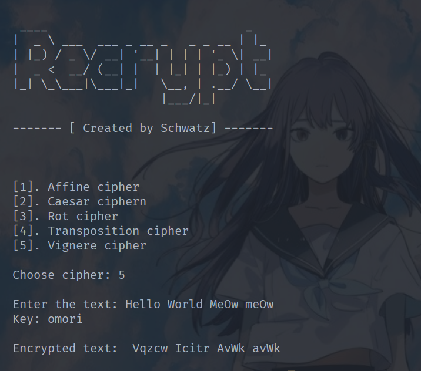
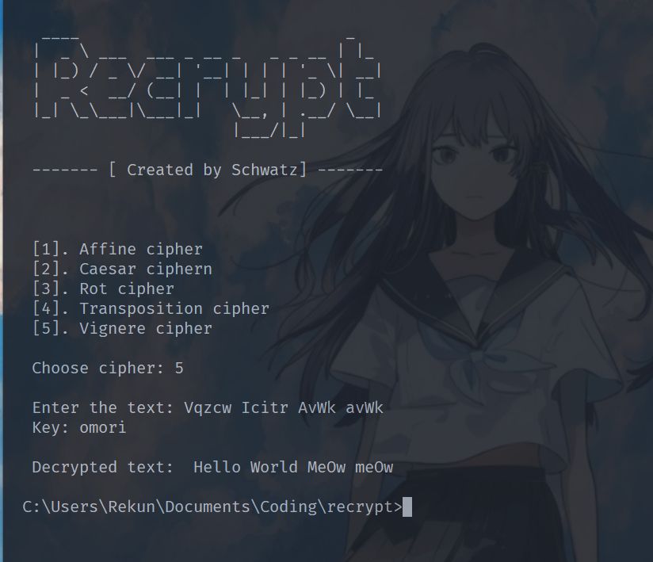

# Recrypt

This project is an implementation of various classic ciphers using Python from scratch. The project includes several classic ciphers such as Affine Cipher, Caesar Cipher, Rot Cipher, Transposition Cipher, and Vigenere Cipher.

 

## Table of Contents

- [Installation](#installation)
- [Usage](#usage)
  - [Affine Cipher](#affine-cipher)
  - [Caesar Cipher](#caesar-cipher)
  - [Rot Cipher](#rot-cipher)
  - [Transposition Cipher](#transposition-cipher)
  - [Vigenere Cipher](#vigenere-cipher)

## Installation

To run this project, make sure you have Python installed. No additional installation is required. Simply download or copy the project's code.

## Usage

### Affine Cipher

**Key**: Affine Cipher uses two keys:
- **Key A (keyA)**: An integer that must be relatively prime to 26.
- **Key B (keyB)**: An integer to control character shifting.

**How to Use**: 
- Encryption: `affenc(plain_text, keyA, keyB)`
- Decryption: `affdec(encrypted_text, keyA, keyB)`

### Caesar Cipher

**Key**: Caesar Cipher uses a single key:
- **Key**: An integer to control character shifting.

**How to Use**:
- Encryption: `encsar(plain_text, key)`
- Decryption: `decsar(encrypted_text, key)`

### Rot Cipher

**Key**: Rot Cipher uses a single key:
- **Key**: A string that specifies the type of rotation method such as "rot13" or "rot18."

**How to Use**:
- Encryption: `rotenc(plain_text, key)`

### Transposition Cipher

**Key**: Transposition Cipher uses a single key:
- **Key**: An integer that determines the reordering of characters in the text.

**How to Use**:
- Encryption: `enctrans(plain_text, key)`
- Decryption: `dectrans(encrypted_text, key)`

### Vigenere Cipher

**Key**: Vigenere Cipher uses a single key:
- **Key**: A string that serves as the encryption keyword.

**How to Use**:
- Encryption: `vigenc(plain_text, key)`
- Decryption: `vigdec(encrypted_text, key)`

Make sure to replace `plain_text` and `key` with the text you want to encrypt and the key you want to use.

